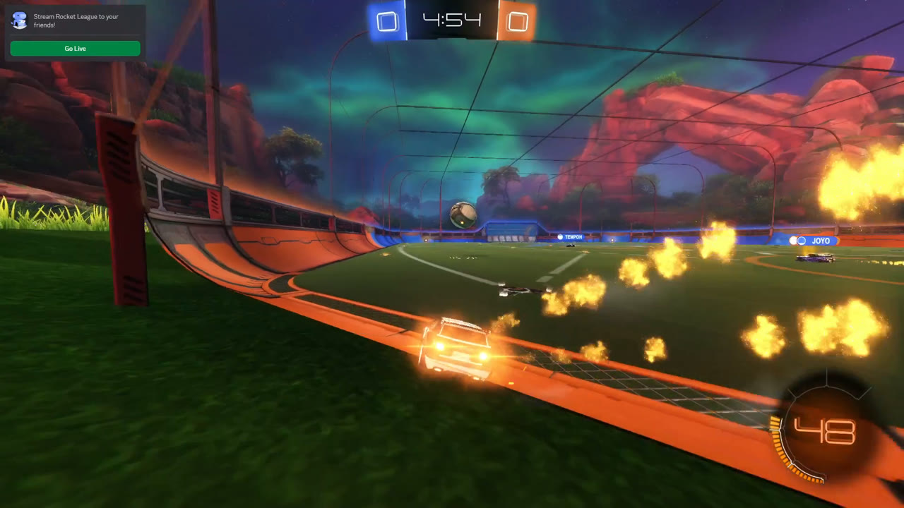
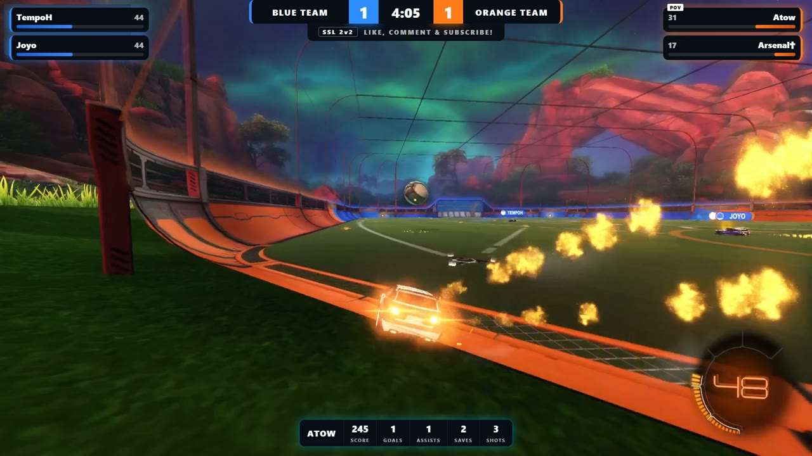
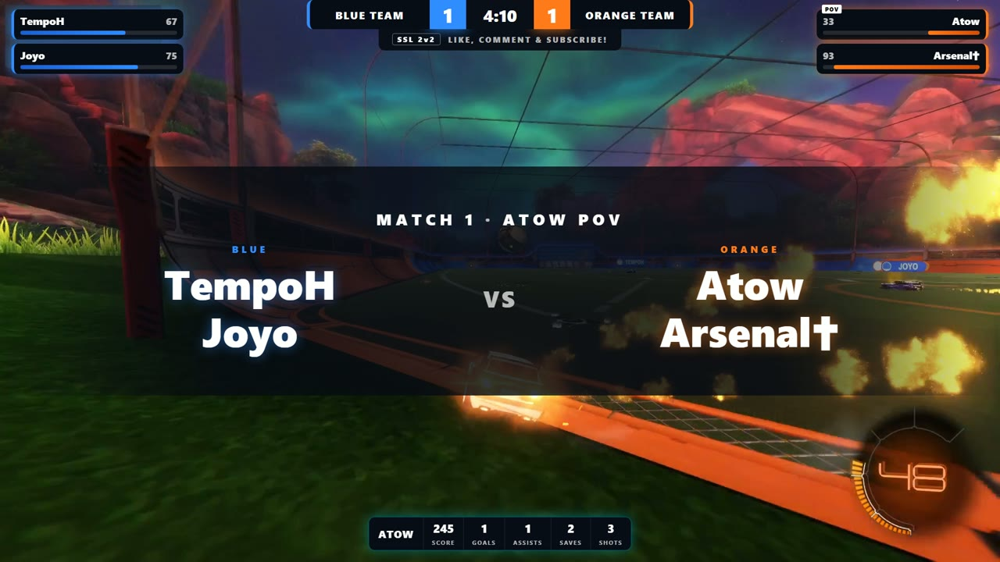
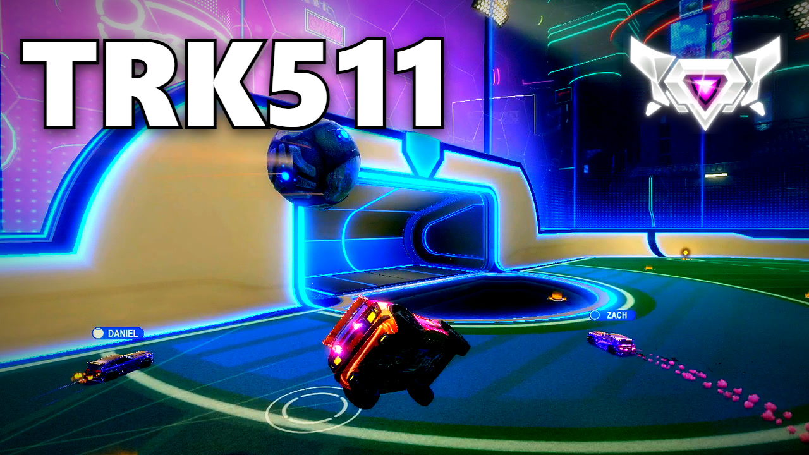
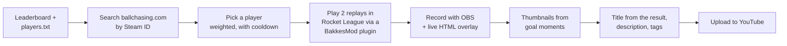

# Rocket League Cinema: a fully automated YouTube channel

[youtube.com/@RocketLeagueCinema](https://www.youtube.com/@RocketLeagueCinema)

A pipeline that turns professional Rocket League players' replays into finished YouTube videos without any human intervention. It finds and downloads pro players' replay files, plays them back inside the real game with a broadcast-style overlay, records them, makes thumbnails from frames, matches to a title that fits what happened, and uploads the result. One scheduled task a day with Task Scheduler keeps the channel running.

Everything is driven by the replay file. A Rocket League `.replay` is a complete recording of a match: every car and the ball's position, every boost pickup and every goal, frame by frame. The game can play it back like a film. All the data in the video comes from that playback, recorded live as it plays. The stats feed the custom HUD, the exact timestamps of the goals decide the thumbnail frames, and whether the player won or lost and by how much picks the title of the YouTube video. Nothing is done by hand.

### Overlays

| Before the custom html/css/js HUD                   | After the custom HUD                          |
| --------------------------------------------------- | --------------------------------------------- |
|  |  |

| Intro overlay with all players         | Generated thumbnail                     |
| -------------------------------------- | --------------------------------------- |
|  |  |

## What a daily run does

1. **Find players and games.** I fetch an online leaderboard of the top 100 players, and pull one of their games randomly from [ballchasing.com](https://ballchasing.com).
2. **Play the replays in the real game.** A custom C++ BakkesMod plugin loads each `.replay` file into Rocket League and does the camera work. It holds the first frame until recording starts, and reads the live game data from the playback (score, clock, boost, stats, goals) 30 times a second.
3. **Record a broadcast.** OBS is driven over its WebSocket API. An HTML/CSS/JS overlay, fed by a small local web server, draws a scoreboard, player boost bars and a stats bar, plus an intro banner listing all players at the start of each game. The two games are joined with fades to black, and the loading screen in between is cut.
4. **Make thumbnails.** Frames are taken just before and after the featured player's fastest goal, then the player's name and rank emblem are composited on with a headless browser.
5. **Write the title.** The YouTube title is created with pattern-matching, based on what happened in the games e.g. `[wins=2]`, `[goals>=4]`, `[comebacks>=1]`
6. **Upload and clean up.** The video is uploaded through the YouTube Data API (OAuth) along with its thumbnail. The large video file is then deleted.
7. **Choose who's next.** Each player's priority is _weight × days since their last video_, so over time popular players appear more often but every player has a chance. There's a history file so the same game doesn't get posted twice. There's also a cooldown so nobody appears two days in a row.

## Engineering highlights

Some of the more interesting problems along the way:

- **The camera grabbed the wrong player.** When the camera cut from the wide kickoff shot back to the featured player, the game would flash through other players for a split second, and the on-screen boost meter sometimes ended up showing someone else's boost. Logging every single frame showed that, for one frame, the game thought it was following the viewer instead of a player. The fix was to stay focused on the featured player even during the wide shot, so the cut back is just a change of camera angle. This works most of the time but occassionally some weird stuff still happens.
- **Goal times drifted.** The replay's own clock doesn't run at a steady pace, so goal times calculated from it were off by up to 10 seconds by the end of a game, and thumbnails showed the wrong moment. Goals are now timed with the computer's real clock as they happen, converted into a position in the video, and checked frame by frame against the scoreboard changing.
- **Boost numbers were out-of-sync.** The overlay's boost sometimes read 1-2 higher than the game's own meter. It turned out to be rounding errors (the game always rounds down) as well as a delay of about a third of a second. With both fixed, the numbers match frame for frame.
- **HUD was flickering sometimes.** Every few seconds the overlay vanished for one frame. Through logging, I discovered that the overlay would sometimes read its data at the exact instant the file was being rewritten, got nothing, and hid itself. Now it keeps the last good data, and only hides after half a second without any.
- **Fair picks and fitting titles.** Who gets the next video is a weighted draw, so popular players appear more often while everyone still gets a turn, and no one appears two days in a row. Titles are written in a small rule format ("only if they won both games", "only with 4+ goals"). Both are covered by tests, including checks that the picks really come out in the right proportions.
- **Built to run unattended.** Anything outside the program's control has a plan B: a saved copy of the leaderboard if it can't be downloaded, another network port if one is busy, no recording when the disk is nearly full, uploads that still happen after a failed recording, and a game window that's restored if something else steals focus. Every run writes a log.

## Tech stack

| Area             | Tool used                                                                                  |
| ---------------- | ------------------------------------------------------------------------------------------ |
| Language         | Python 3.12                                                                                |
| In-game control  | C++ BakkesMod plugin (BakkesMod SDK), rcon over WebSocket                                  |
| Recording        | OBS Studio 32 via obs-websocket v5                                                         |
| Overlay          | HTML/CSS/JS browser source, served by a local Python HTTP server                           |
| Video and images | ffmpeg, headless Microsoft Edge for compositing                                            |
| Data sources     | ballchasing.com REST API, rlstats.net (BeautifulSoup)                                      |
| Publishing       | YouTube Data API v3 with OAuth 2.0                                                         |
| Testing          | `unittest` to test naming, overlays, stats, titles, scheduling, uploads and the HUD server |

## Running it

It needs Windows, Rocket League with BakkesMod, OBS Studio, ffmpeg, a ballchasing.com API key, and a Google Cloud project for YouTube uploads. Every setting is explained in `config.toml`
